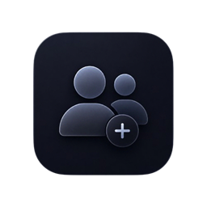
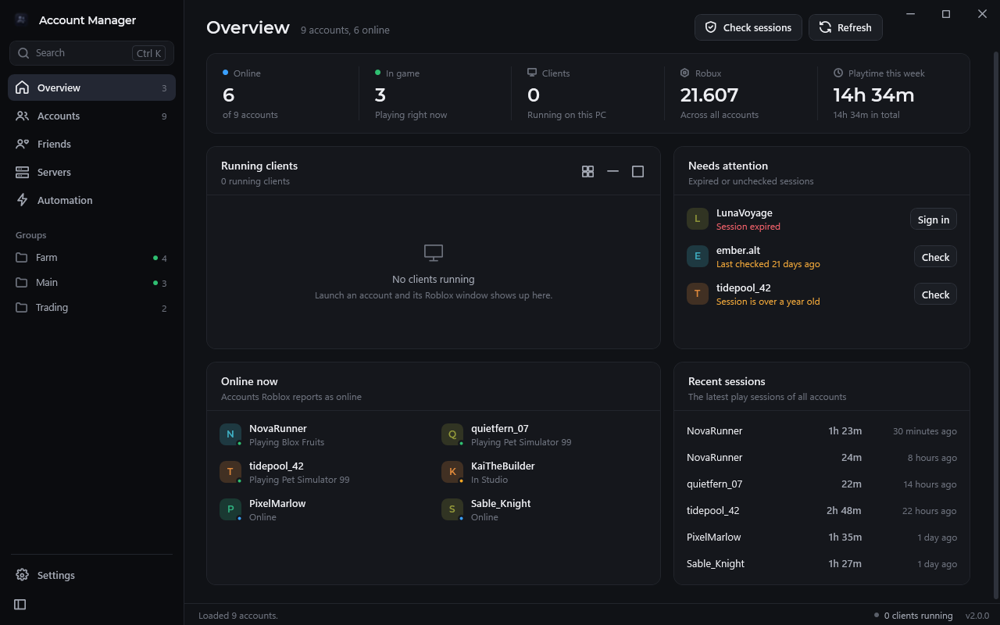
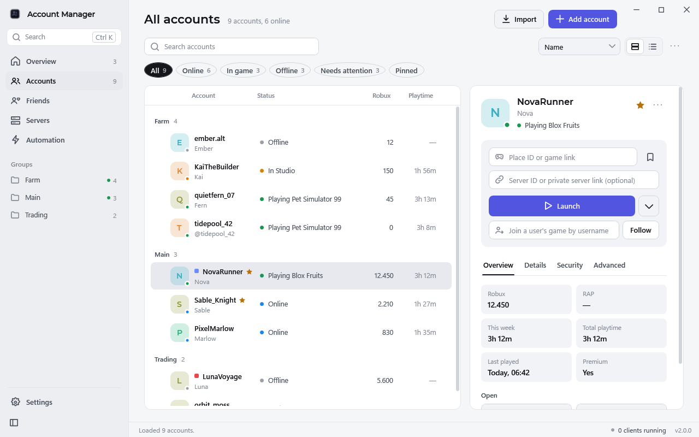
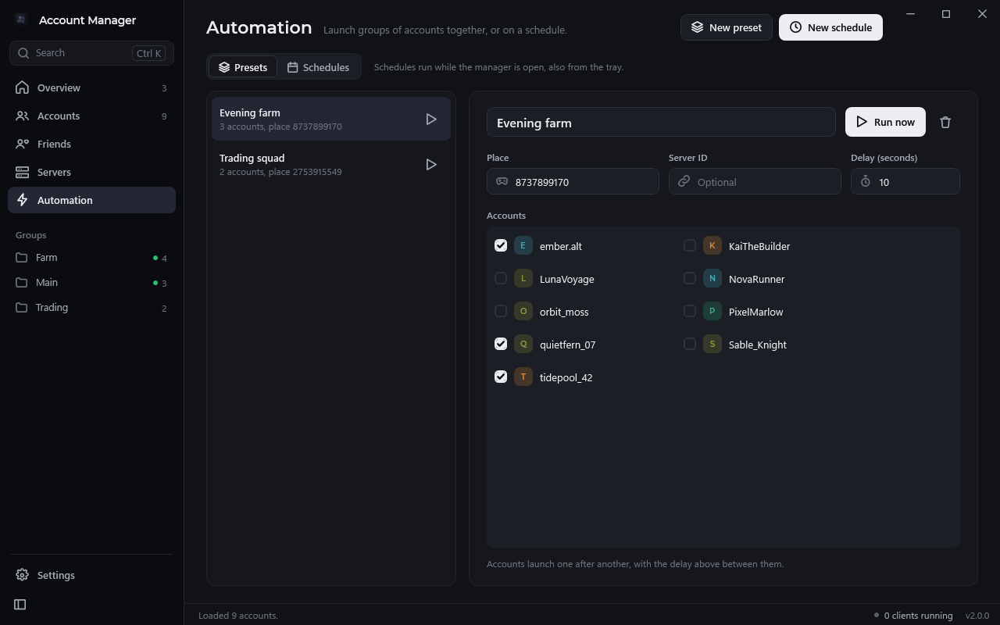
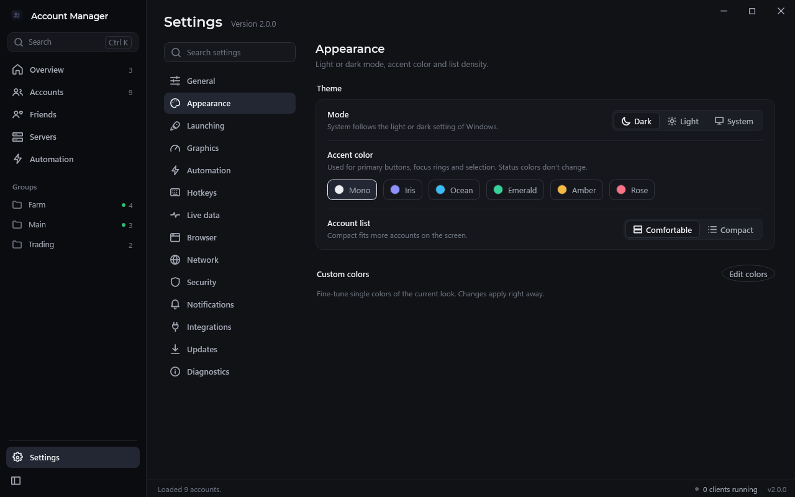
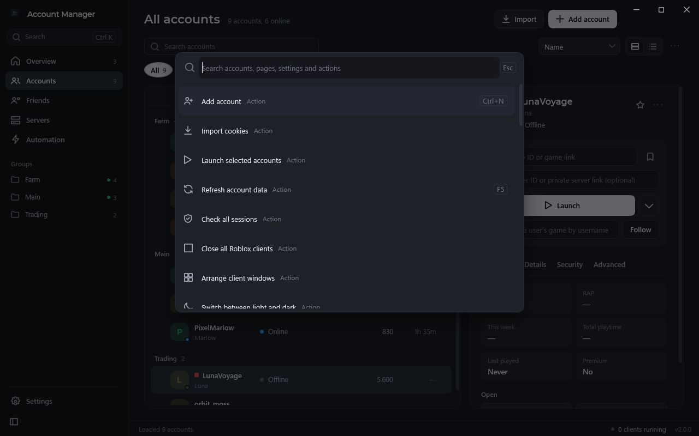
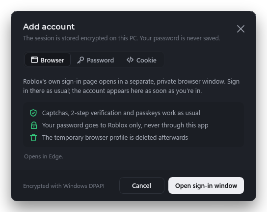

<div align="center">



# Roblox Account Manager

**All your Roblox accounts in one calm, fast desktop app.**<br>
Sign in once, launch any account into any game with a click, run several side by side.

<p>
  <a href="https://github.com/Vaelixx/Roblox-Account-Manager/releases/latest"></a>
  <a href="https://github.com/Vaelixx/Roblox-Account-Manager/releases"></a>
  
  
  
</p>

<p>
  <a href="https://github.com/Vaelixx/Roblox-Account-Manager/releases/latest"><b>Download</b></a> ·
  <a href="#features">Features</a> ·
  <a href="#getting-started">Getting started</a> ·
  <a href="#security-and-privacy">Security</a> ·
  <a href="#building-from-source">Build</a> ·
  <a href="#faq">FAQ</a>
</p>



</div>

## What's new in 2.0

Version 2.0 is a rebuild of the whole interface, and it closes every item that was open on the
roadmap:

- A new layout with a sidebar, an **Overview**, and an account list with a detail panel
- **Light, dark and system themes** with six accent colors
- **Eight languages:** English, Deutsch, Español, Français, Português (Brasil), Polski, Türkçe, Русский
- **Account health**, a **presets and schedules editor**, and **per-account proxies** that are actually applied
- **Browser sign-in by default**, so captchas, 2-step verification and passkeys just work
- **Lock the app** with your master password, secrets that clear themselves from the clipboard, and a hardened local API

The full list, including what to know before updating, is in the [changelog](CHANGELOG.md).

## Features

**Accounts**
- Add accounts by signing in on Roblox's own login page, with username and password, or by pasting a cookie
- Groups, aliases, notes, color tags and pinned accounts
- Live online status, avatars, Robux and playtime for every account
- Account health: expired sessions, sessions not checked for two weeks and very old sessions are flagged, with a one-click fix
- Built-in 2FA code generator per account
- Import from ic3w0lf's Roblox Account Manager, export to CSV or JSON, encrypted backups you can restore on another PC

**Launching**
- One click into any game, a specific server, a private server or share link
- Several clients at the same time, including clients started from the website
- Smart join, lowest-ping join, server hop, squad join (a server with room for everyone) and follow a player
- Server browser with player counts and ping
- Friends page: see what an account's friends are playing and join them

**Automation**
- Presets: launch a set of accounts into the same game with one click
- Schedules: launch or close accounts at a time and on the days you pick, and close them again after a while
- Anti-AFK, crash recovery with auto-rejoin, memory limits and memory trimming
- Global hotkeys, a command line (`--launch`), a local HTTP API and plugins

**Look and feel**
- Light, dark or system theme, six accent colors and comfortable or compact density
- Command palette (**Ctrl+K**) for every account, page, setting and action
- Settings in categories with search
- Frame-rate cap and FastFlags that follow Roblox's current allowlist
- Runs from the system tray, starts with Windows if you want

<table>
  <tr>
    <td width="50%"></td>
    <td width="50%"></td>
  </tr>
  <tr>
    <td></td>
    <td></td>
  </tr>
</table>

## Getting started

1. Download `RobloxAccountManager.exe` from the [latest release](https://github.com/Vaelixx/Roblox-Account-Manager/releases/latest).
2. Put it in its own folder. It keeps its data in a `data` folder next to itself.
3. Run it and choose **Add account**.

> [!NOTE]
> The exe isn't code-signed, so Windows SmartScreen may warn the first time. Choose **More info → Run
> anyway**, or [build it yourself](#building-from-source).

### Adding an account



**Browser** (recommended) opens Roblox's own login page in a separate window with a fresh, temporary
browser profile. Sign in as usual. Captchas, 2-step verification and passkeys work, your password
never passes through the app, and the profile is deleted afterwards. Edge or Chrome is used when
installed; otherwise the app offers to download a private Chromium build for sign-in.

**Password** signs in through Roblox's login service directly. It's quick, but when Roblox asks for
a captcha you'll be sent to the Browser tab.

**Cookie** takes a `.ROBLOSECURITY` value you already have.

<br clear="right">

### Launching

Select an account, paste a **Place ID or game link**, and press **Launch**. Add a server ID or a
private server link to join a specific server. The arrow next to **Launch** has smart join, lowest
ping, server hop and squad join. Tick several accounts to launch them one after another.

### Updating

The app tells you when a new version is out. **Settings → Updates** checks on demand, verifies every
download against its SHA-256 before installing, and keeps the previous version so you can roll back.
Updating from 1.x works the same way: your accounts and settings are carried over.

## Security and privacy

Session cookies are the keys to your accounts, so the app treats them that way.

- **Encrypted at rest.** The account file is encrypted with Windows DPAPI, or with your master password (AES-256-GCM, PBKDF2). Each cookie is encrypted again on its own.
- **Passwords aren't stored.** Browser sign-in never shows your password to the app. Password sign-in sends it to Roblox and keeps nothing.
- **Lock.** With a master password you can lock the app with **Ctrl+L**, after a period of inactivity, or when it's minimized.
- **Clipboard hygiene.** Copied cookies, tokens and 2FA codes are removed after 30 seconds and kept out of clipboard history and cloud sync.
- **Local only.** No account, no server, no telemetry. The app talks to Roblox, to GitHub for updates, and to Discord only if you add a webhook.
- **Hardened local API.** Off by default, bound to `127.0.0.1`, token-protected, refuses requests from web pages, and never hands out cookies unless you allow it.
- **Plugins are opt-in**, with a clear warning, because a plugin runs with full access.
- **Open source.** Everything that touches your accounts is in this repository.

## Languages

English, Deutsch, Español, Français, Português (Brasil), Polski, Türkçe and Русский. The app starts
in your Windows language and can be switched under **Settings → General** without a restart.

Translations live in [`src/Localization`](src/Localization), one JSON file per language. To add or
fix one, edit the file and run `python tools/check-localization.py`, which checks that every key and
placeholder matches English.

## Local API

Turn it on under **Settings → Integrations**. Every request needs the token as
`Authorization: Bearer <token>`.

| Method | Path | |
|---|---|---|
| GET | `/ping` | Health check, no token needed |
| GET | `/accounts` | Accounts with status and health (no cookies) |
| GET | `/status?account=` | Presence of one account |
| POST | `/launch?account=&placeId=&jobId=` | Launch an account |
| POST | `/close?account=` | Close that account's clients |
| GET | `/cookie?account=` | Only when **Allow reading cookies** is on |

`account` accepts a user ID, alias or username.

## Building from source

Requires the [.NET 8 SDK](https://dotnet.microsoft.com/download/dotnet/8.0) on Windows.

```powershell
git clone https://github.com/Vaelixx/Roblox-Account-Manager.git
cd Roblox-Account-Manager

# run a development build
dotnet run --project src/RobloxAccountManager.csproj

# single-file, self-contained exe in .\publish
dotnet publish src/RobloxAccountManager.csproj -c Release -r win-x64 --self-contained true `
    -p:PublishSingleFile=true -p:IncludeNativeLibrariesForSelfExtract=true `
    -p:EnableCompressionInSingleFile=true -p:DebugType=none -o publish
```

Debug builds have a demo mode that runs on a temporary folder with made-up accounts, so you can work
on the interface without touching real ones:

```powershell
dotnet run --project src/RobloxAccountManager.csproj -- --demo --demo-theme Light --demo-lang de
```

### Releasing

1. Add a `## vX.Y.Z — YYYY-MM-DD` section to the top of [`CHANGELOG.md`](CHANGELOG.md).
2. Set `<Version>` in `src/RobloxAccountManager.csproj` to the same number.
3. Push the tag `vX.Y.Z`.

The [release workflow](.github/workflows/release.yml) checks the translations, builds with zero
warnings allowed, publishes `RobloxAccountManager.exe` with its SHA-256, and uses the changelog
section as the release notes. The same section is embedded in the app and shown under **What's new**.
A tag with a suffix such as `v2.1.0-beta.1` becomes a pre-release.

| | |
|---|---|
| UI | WPF on .NET 8, MVVM, themed with dynamic resources |
| Tray and hotkeys | Native Win32, no WinForms |
| Storage | DPAPI or AES-256-GCM encrypted local files |
| Fonts | Segoe UI Variable, Montserrat ([OFL](src/Assets/Fonts/OFL.txt)) |

## Roadmap

Shipped in 2.0: account health, the presets and schedules editor, per-account proxies, light mode,
the new interface and eight languages.

Ideas for next versions, open an [issue](https://github.com/Vaelixx/Roblox-Account-Manager/issues) to
vote or suggest more:

- [ ] Per-group launch defaults (place, delay, FastFlags)
- [ ] Playtime charts per account
- [ ] More languages

## FAQ

<details>
<summary><b>Where do my cookies go?</b></summary>

Nowhere but your own disk, encrypted, and Roblox's official endpoints when the app checks a session
or launches a game, the same as your browser does.
</details>

<details>
<summary><b>I updated from 1.x. What changes for me?</b></summary>

Accounts and settings are migrated automatically, and your old settings file is kept as
`settings.json.v0.bak`. Theme presets become accent colors, and an FPS unlock becomes the new FPS cap.
If you use the local API, `/launch` and `/close` now need POST. See the [changelog](CHANGELOG.md) for
details.
</details>

<details>
<summary><b>What if an update breaks something?</b></summary>

**Settings → Updates → Roll back** restores the previous version and restarts. Your `data` folder is
never touched by an update.
</details>

<details>
<summary><b>Why doesn't my FPS unlock FastFlag work anymore?</b></summary>

Since September 2025 Roblox only accepts FastFlags from an allowlist. Use the **FPS cap** under
**Settings → Graphics**, which writes Roblox's own frame-rate setting.
</details>

<details>
<summary><b>Can I run more than one Roblox client?</b></summary>

Yes. Multiple clients are on by default, including clients you start from the website.
</details>

<details>
<summary><b>Does this break Roblox's Terms of Service?</b></summary>

The app does what you could do by hand in a browser: sign in and launch games, through official
endpoints. Automation features are a grey area, so use them responsibly and at your own risk.
</details>

## Contributing

Issues and pull requests are welcome. For larger changes, open an issue first.

- Keep the MVVM structure and nullable annotations
- `dotnet build -c Release -warnaserror` must pass
- New UI text goes into `src/Localization/en.json`, and `python tools/check-localization.py` must pass

<div align="center">
<br>

Not affiliated with Roblox Corporation. You are responsible for your own accounts.

</div>
